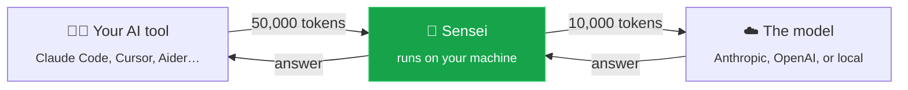
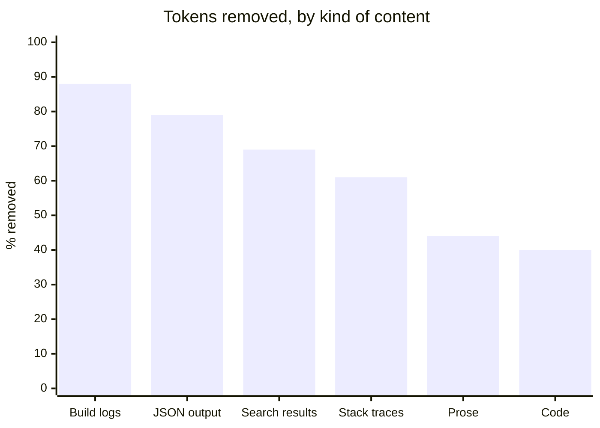

<div align="center">


# Sensei

### Your AI tools, using a fraction of the tokens.

<sub>A self-hosted workspace built on the compression ideas from
<a href="https://github.com/headroomlabs-ai/headroom">Headroom</a> and the
workspace design of <a href="https://github.com/pewdiepie-archdaemon/odysseus">Odysseus</a>.</sub>

[](https://github.com/SenseiIssei/Sensei/actions/workflows/ci.yml)
[](https://github.com/SenseiIssei/Sensei/actions/workflows/security.yml)
[](LICENSE)
[](https://python.org)

</div>

---

## The idea in one picture

AI tools send a lot of text to the model. Most of it is repetitive — file
listings, build logs, JSON blobs. You pay for every character of it.

Sensei sits in the middle and squeezes that text down before it's sent. The
model still gets everything it needs; you just stop paying for the padding.



**Nothing changes about how you work.** Same tools, same API key, same answers.
Just a smaller bill.

---

## How much smaller?

These are real measurements, not estimates. You can run them yourself with one
command (see [For the nerds](#-for-the-nerds)).



**Across a realistic mix: 79% fewer tokens.**

For JSON and logs — which is where AI coding tools spend most of their budget —
nothing is lost. Sensei restructures the text rather than summarising it, so the
model sees the same facts.

> **What that means in money.** If you spend €100/month on API calls, a 79%
> reduction on the input side is a large part of that bill. Sensei shows you the
> running total: `sensei stats`.

---

## Get started

**1. Install**

```bash
pipx install sensei-gateway
```

<details>
<summary>Other ways in</summary>

```bash
brew install senseiissei/tap/sensei      # macOS and Linux
winget install SenseiIssei.Sensei        # Windows
scoop bucket add senseiissei https://github.com/SenseiIssei/scoop-bucket
scoop install sensei                     # Windows, portable
pip install sensei-gateway               # any platform with Python 3.11+
```

Or download a single file from [the latest
release](https://github.com/SenseiIssei/Sensei/releases/latest) — `.exe` for
Windows, `.dmg` for macOS, `.AppImage`/`.deb`/`.rpm` for Linux — which needs no
Python at all.

The distribution is called `sensei-gateway` because `sensei` on PyPI is an
unrelated HTTP library from 2023. The command you type is `sensei`.

</details>

**2. Start it**

```bash
sensei up
```

Your browser opens and asks you one question: do you want to run a model on your
own computer (free), or use a service like OpenAI (paste a key). Pick one, click
save. Done.

**3. Point your tools at it**

```bash
sensei setup-tools
```

Sensei finds the AI tools already on your machine — Claude Code, Claude Desktop,
Cursor, Windsurf, Cline, Roo, Kilo, Zed, Continue, Codex, Aider — and configures
them. You are shown exactly which files it will touch before it touches them,
every one is backed up, and `sensei setup-tools --undo` puts them all back.

Only some of your work should route through it? `sensei setup-tools --project`
writes the configuration into the current repository instead of the machine, so
you can commit it for everyone or keep it to one checkout.

To confirm it actually worked rather than assuming:

```bash
sensei doctor --verify
```

That sends a real request through the running gateway and reports what came
back — separately from whether your provider is set up, because "compression is
broken" and "you haven't added a key yet" are different problems with different
fixes.

For a tool you launch from a terminal, there is also the no-config version,
which sets one environment variable for that process and nothing else:

```bash
sensei wrap claude
```

Same for `codex`, `aider`, `cursor-agent`, `cline`, `continue`, `opencode`,
`goose` and `crush` — just swap the name.

**4. Watch the number go up**

Open <http://localhost:7000/app/> and click **Tokens Saved**: what you saved
today, over the last thirty days, and which tool saved it. `sensei stats` prints
the same thing in the terminal.

The history is a SQLite file on your own disk holding counters and model names —
no prompts, no responses, nothing transmitted. `SENSEI_SAVINGS_PERSIST=false`
turns it off and the totals go back to being per-process.

**Or use it as an MCP server**

If your tool speaks [MCP](https://modelcontextprotocol.io), Sensei plugs in
directly — no base URL to change:

```jsonc
{
  "mcpServers": {
    "sensei": { "command": "sensei", "args": ["mcp"] }
  }
}
```

The agent gets three tools: compress a blob before putting it in context, get
the exact original back if it turns out it needed it, and check what's been
saved. Needs `pip install "sensei-gateway[mcp]"`.

<details>
<summary><b>Prefer Docker?</b></summary>

```bash
git clone https://github.com/SenseiIssei/Sensei.git && cd Sensei
docker compose up -d
```

Then open <http://localhost:7000/app/>.

</details>

---

## What it looks like

> **Screenshots wanted.** These aren't in the repo yet. If you run Sensei, a
> screenshot of the setup screen and the chat window would be a genuinely
> useful contribution — drop them in `docs/screenshots/` and open a PR.
> See [`docs/screenshots/README.md`](docs/screenshots/README.md).

Here is what the command line shows, which is real output:

```console
$ sensei models

Your machine

  System   Windows 11 (AMD64)
  CPU      16 cores
  RAM      15.3 GB
  GPU      none detected — models will run on the CPU
  Budget   7.7 GB usable for a model

Suggestions for this machine

  Qwen2.5 Coder 7B             7B     4.6 GB  fits comfortably
    Code completion and review. Pairs well with the gateway.
  Llama 3.2 3B                 3B     2.0 GB  fits comfortably
    General chat on modest hardware. A sensible floor.
  GLM-5.2                744B MoE   390.6 GB  too large

Start here:  sensei models --pull qwen2.5-coder:7b
```

Something not working? Sensei tells you what to do about it:

```console
$ sensei doctor

  [+] Python             3.12.10 on Windows AMD64
  [+] Config file        D:\Sensei\.env
  [!] Ollama             not installed
        -> Optional. For free local inference: https://ollama.com
  [x] Model access       no local model and no API key — Sensei cannot answer anything
        -> Either install Ollama (free, local) or run 'sensei up' and paste an
           API key into the setup wizard.
  [+] Port               127.0.0.1:7000 is free
  [+] Bind address       127.0.0.1
```

---

## Your data stays yours

This matters more than the token savings, so it's worth being specific.

| | |
|---|---|
| 🔒 **Runs only on your machine** | Sensei listens on `127.0.0.1`. Nothing on your network can reach it unless you deliberately change that. |
| 🚫 **No telemetry, ever** | No analytics, no crash reporting, no "anonymous usage data". Not in any build, not behind any flag. |
| 📡 **No third-party requests** | The interface loads no fonts, scripts or trackers from anyone. This is checked automatically on every commit. |
| 💾 **The savings history is a local file** | `SENSEI_SAVINGS_PERSIST` writes counters and a model name per request to a SQLite file next to Sensei. No prompt text, no responses, and nothing leaves the machine. Delete the file, or turn it off. |
| 🔑 **Your key stays yours** | Sensei forwards your API key to the provider you chose and to nobody else. It's encrypted on disk, never written in plain text. |
| ✂️ **Secrets stripped** | Optionally, Sensei removes passwords, tokens and keys from prompts before they leave your computer. |
| 📴 **Works offline** | If the server isn't running, the interface still opens and tells you how to start it. |

---

## Common questions

<details>
<summary><b>Does this make the AI worse?</b></summary>

For logs and JSON — the bulk of what coding tools send — no. Sensei rewrites
that text into a denser form containing the same facts, rather than summarising
it. For prose it removes filler ("it is important to note that" → nothing),
which is the kind of text a model ignores anyway.

If the model ever does need the original, it can ask for it: Sensei keeps a
local copy of everything it compressed and hands it back on request.

</details>

<details>
<summary><b>Do I need to change my code or my tools?</b></summary>

No. `sensei wrap claude` sets one environment variable for that program and
launches it. Nothing is written to your shell profile, nothing is installed into
your tool, and closing it puts everything back.

</details>

<details>
<summary><b>Do I still need an API key?</b></summary>

Only if you want to use a hosted model. Sensei can run entirely on your own
computer with [Ollama](https://ollama.com) — `sensei models` tells you which
models actually fit in your memory.

</details>

<details>
<summary><b>Is it really free?</b></summary>

Yes. MIT licensed, no paid tier, no feature held back. See the
[principles](ROADMAP.md#principles).

</details>

<details>
<summary><b>What if I don't like it?</b></summary>

`pip uninstall sensei`. Sensei keeps its data in dot-directories next to where
you ran it; delete them and nothing remains.

</details>

---

## 🤓 For the nerds

<details>
<summary><b>Architecture</b></summary>

Sensei is a FastAPI service that speaks both the OpenAI and Anthropic wire
formats, so anything with a configurable base URL routes through it unchanged.

```mermaid
flowchart TB
    subgraph client["Clients"]
        CC["Claude Code<br/><sub>ANTHROPIC_BASE_URL</sub>"]
        CX["Codex / Cursor / Aider<br/><sub>OPENAI_BASE_URL</sub>"]
        WEB["Web UI"]
        CLI["CLI · Qt app · VS Code ext"]
    end

    subgraph sensei["Sensei"]
        GW["Gateway<br/><sub>/v1/chat/completions · /v1/messages</sub>"]
        RT["ContentRouter<br/><sub>detects type, picks a compressor</sub>"]
        subgraph comp["Compressors"]
            SC["SmartCrusher<br/><sub>JSON → CSV schema</sub>"]
            LC["LogCompressor<br/><sub>triage + dedupe</sub>"]
            CD["CodeCompressor<br/><sub>comments, imports</sub>"]
            TC["TextCompressor<br/><sub>filler, boilerplate</sub>"]
        end
        CA["CacheAligner<br/><sub>keeps the prefix byte-exact</sub>"]
        CCR["CCR store<br/><sub>originals, retrievable</sub>"]
        RED["DLP redaction<br/><sub>strips secrets</sub>"]
    end

    PROV["Provider<br/><sub>Anthropic · OpenAI · Ollama · 11 more</sub>"]

    CC --> GW
    CX --> GW
    WEB --> GW
    CLI --> GW
    GW --> RT
    RT --> SC & LC & CD & TC
    SC & LC & CD & TC --> CA
    CA --> RED
    RED --> PROV
    RT -.stores originals.-> CCR
    CCR -.on request.-> PROV

    style sensei fill:#0a0a0f,stroke:#22c55e
    style comp fill:#111827,stroke:#374151
```



The system prompt is left byte-identical on purpose. Providers cache on an exact
prefix match, so touching it would invalidate the cache and cost more in latency
than compression saves.

</details>

<details>
<summary><b>How each compressor works</b></summary>

**SmartCrusher — JSON.** An array of objects with the same keys repeats every key
name on every element. It's rewritten as a header plus rows, which is what a CSV
is, and drops redundant link/self/href keys. Lossless.

```
[{"id":1,"name":"a","url":"…"},{"id":2,"name":"b","url":"…"}, …20 more]
  ↓
id|name|url
1|a|…
2|b|…
```

**LogCompressor — build and test output.** Keeps the head, the tail, every line
matching an error/warning/summary pattern, and a few lines of context after each.
Identical lines are collapsed after normalising timestamps, hex addresses and
UUIDs, so a thousand near-identical worker lines become one with a count.

**CodeCompressor — source.** Strips comments, docstrings, blank lines and
trailing whitespace, and folds consecutive import blocks. Regex-driven per
language rather than a full parse, for speed and zero dependencies.

**TextCompressor — prose.** Phrase substitution ("in order to" → "to"), filler
removal, boilerplate sentence stripping, and line-level dedupe.

**CCR — reversible compression.** Every original is written to a local cache
keyed by id. If the model decides it needs the untouched text, it asks for it by
id and gets it back. Compression is therefore never destructive in practice.

</details>

<details>
<summary><b>MCP server</b></summary>

`sensei mcp` speaks the Model Context Protocol over stdio, which covers the
tools that don't let you redirect a base URL — and the case where an agent wants
to compress one specific blob rather than route its whole conversation.

| Tool | What it does |
|---|---|
| `sensei_compress` | Compress text. Returns the compressed form, a `ccr_id`, the token counts and the percentage saved. Optionally force a compressor with `content_type`. |
| `sensei_retrieve` | Exchange a `ccr_id` for the byte-identical original. |
| `sensei_stats` | Totals saved, plus CCR cache state. |

`sensei_retrieve` is what makes this safe rather than lossy-by-default.
Compression is never a one-way door: if the model decides the compressed form is
missing something, it asks for the original instead of guessing. The server's
instructions tell the client exactly that, because a capability a model doesn't
know about might as well not exist.

Verified end to end against a real MCP client — 582 → 287 tokens on a 40-record
JSON array, original recovered byte-identical.

```bash
pip install "sensei-gateway[mcp]"
sensei mcp            # stdio; normally your client spawns this, not you
```

</details>

<details>
<summary><b>Performance</b></summary>

Compression sits on the hot path of every request, so its own cost matters.
Measured on an 86 kB agent turn — system prompt, exchanges, a large JSON tool
result, build logs and source:

| | before optimisation | after |
|---|---|---|
| median | 8.14 ms | **4.68 ms** |
| p95 | 12.53 ms | **6.31 ms** |
| cold start | 9.34 ms | 6.91 ms |

What that took: compiling the detector patterns once instead of per line,
bounding the type-detection scan to the sample it actually reads instead of
splitting the whole payload, and removing ~11,000 `re` cache lookups per request.

An optional Rust accelerator (`sensei_core`, PyO3, abi3) makes the JSON hot path
roughly twice as fast again. CI builds the wheel and re-runs the entire test
suite against it on every commit, so "byte-identical to the Python path" is
verified rather than asserted.

</details>

<details>
<summary><b>Reproducing the numbers</b></summary>

```bash
python backend/benchmarks/compression_benchmark.py
```

Real `tiktoken` (`cl100k_base`) counts over a fixed corpus of tool outputs, logs,
stack traces, source and prose. `--json` gives machine-readable output and
`--min-aggregate 75` exits non-zero below a floor — which is what nightly CI
runs, so a regression in compression quality fails the build rather than being
noticed months later.

Every run is published: **[the nightly trend](https://senseiissei.github.io/Sensei/)**
keeps one row per night, so 79% is a line you can look at rather than a number
in a README.

</details>

<details>
<summary><b>Does it keep what the model needs?</b></summary>

A different question from "does it get smaller", and until recently only the
second one was checked anywhere here.

```bash
python backend/benchmarks/quality_eval.py
```

Each corpus entry is paired with the facts an agent would have to extract from
it — the error location in a build log, the failing frame in a stack trace,
specific ids and values in JSON, a function signature in source. All of them
must still be literally present after compression. Nightly runs it with a floor
of **100%**, because unlike a savings percentage a lost fact is never jitter.

Be clear about the claim: this is a **necessary condition, not a sufficient
one.** If a fact is gone the model provably cannot answer; if every fact
survives the model *can* answer, but this does not prove it *will*. The
sufficient version needs a model in the loop — `--model gpt-4o --base-url ...`
does that, and it is deliberately not part of the nightly gate, because a gate
that needs a funded API key is a gate somebody eventually switches off.

Writing this eval immediately found two real defects: `LogCompressor.FRAME`
contained `File ", "` where `File "` was meant, so no Python traceback frame
ever matched and the innermost frames — the ones that say what actually broke —
were being elided. And build output with no timestamps and no log levels was
being classified as prose, which both compressed it 3% instead of 91% and threw
away the compiler's `file:line:col`.

</details>

<details>
<summary><b>Security model</b></summary>

Sensei assumes the machine it runs on is trusted and that anyone who can reach
the port is authorised. Everything else follows from that:

- Binds to `127.0.0.1`. Exposing it is a deliberate act, and `sensei doctor`
  reports it as a failure if you do it without enabling auth.
- API keys live in an encrypted vault (AES-256-GCM), not in `.env`.
- Optional DLP redaction strips API keys, tokens, private keys, JWTs and
  optionally PII from prompts before they leave the machine.
- Optional per-user auth, JWT sessions, OIDC SSO, and RBAC on admin endpoints.
- `run_python` is off by default. When enabled it is a subprocess with a
  timeout, not a container — the docs say so plainly.

Full scope and reporting process: [SECURITY.md](SECURITY.md).

</details>

<details>
<summary><b>Repository layout</b></summary>

```
backend/          FastAPI service, compression pipeline, CLI, tests
  sensei/
    compression/  SmartCrusher, LogCompressor, CodeCompressor, TextCompressor,
                  CacheAligner, CCR, ContentRouter
    routers/      gateway, chat, RAG, agent, settings, setup, stats, …
    security/     auth, crypto, vault, redaction, RBAC, OIDC, sessions
    integrations  writes Sensei into other tools' config files, reversibly
    savings.py    in-memory totals + the local SQLite savings ledger
    cli/          up · wrap · setup-tools · doctor · models · stats · chat
  benchmarks/     the compression benchmark
frontend/         React 19 + Tailwind 4 + Vite 8, PWA
rust/sensei_core/ optional PyO3 accelerator
extensions/vscode VS Code extension
training/         Sensei-Compressor fine-tuning scaffold
deploy/           nginx · Caddy · Traefik · systemd
docs/             configuration reference (generated), the plan
```

</details>

<details>
<summary><b>What CI actually enforces</b></summary>

Every action is pinned to a commit SHA. On each pull request:

- backend tests across **{Linux, macOS, Windows} × Python {3.11, 3.12, 3.13}**
- `ruff` lint and format, with the rule set pinned so a new ruff release can't
  fail an unrelated PR
- the Rust accelerator built and the **whole suite re-run against it** to prove
  byte-parity
- Playwright on three operating systems
- a 450 kB JavaScript budget
- the config reference regenerated from the pydantic model and compared
- the built UI checked for third-party origins, and for root-absolute asset
  URLs that would blank the page when mounted under `/app/`
- Docker image built and `/health` smoke-tested
- pip-audit, npm audit, cargo audit, CodeQL, gitleaks, Trivy, SBOM, Scorecard

Nightly: the compression benchmark with a regression floor, **fact retention at
a floor of 100%**, Rust/Python output diffed for parity, the suite against
eagerly-upgraded dependencies, and the results appended to the
[public trend](https://senseiissei.github.io/Sensei/).

</details>

---

## Standing on other people's shoulders

Sensei didn't invent any of this. Two projects did the hard thinking, and both
are worth your time independently of whether you ever use Sensei:

### 🪶 [Headroom](https://github.com/headroomlabs-ai/headroom) · Apache-2.0

**The reason this project exists.** Headroom worked out that the way to cut an
agent's token bill isn't to summarise its context — it's to notice that most of
what agents send is *structurally* redundant, and restructure it losslessly.
Tabular JSON compaction, log triage, cache-aligned prefixes, and reversible
compression with a retrieval tool are all Headroom's ideas.

If you want context compression as a mature, standalone product with a much
larger surface than Sensei's — output-token shaping, a learned prose compressor,
LangChain and LiteLLM adapters, agent wrapping for a dozen tools — **go use
Headroom.** It's excellent, and it's further along than this.

Sensei's angle is different: compression as one part of a self-hosted workspace
you own end to end, MIT-licensed, that also gives you a chat UI, RAG, an agent
and a desktop app.

### 🏛️ [Odysseus](https://github.com/pewdiepie-archdaemon/odysseus) · AGPL-3.0

**The shape of the thing.** Odysseus — by Felix Kjellberg — made the case that a
self-hosted AI workspace should feel like a finished product rather than a pile
of scripts: hardware-aware model recommendations, a real editor, agents, memory,
and security defaults that assume you'll actually deploy it. The "what can my
machine actually run?" idea behind `sensei models` is straight from its Cookbook.

Sensei is a **clean-room implementation** — no Odysseus code is copied, which is
what lets it stay MIT instead of inheriting AGPL. If you want the full workspace
with email, calendar, documents and image editing, **Odysseus is the more
complete answer.**

> Neither project endorses this one. Any bugs here are ours.

Also worth knowing: [GLM-5.2](https://github.com/zai-org/GLM-5.2) is the model
Sensei's defaults point at, and the reason a lot of the compression tuning
assumes a very large context window.

---

## Contributing

Issues and PRs welcome — [CONTRIBUTING.md](CONTRIBUTING.md) has the setup.

**[docs/ROADMAP-NEXT.md](docs/ROADMAP-NEXT.md) is the queue** — what's planned,
in what order, and why. It also lists the things that cost real time to discover
and aren't visible from reading the code.

Most useful right now: compression heuristics for more languages, output-token
shaping, mobile polish, and [screenshots for this page](docs/screenshots/README.md).

<div align="center">
<sub>MIT · built by <a href="https://github.com/SenseiIssei">@SenseiIssei</a></sub>
</div>
